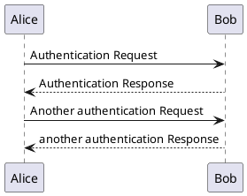

# Hallo, Doku!

> Starter-Template für die M151-Dokumentation

Dies ist die Einstiegsseite für die Projektdokumentation des Moduls M151. Ändern Sie diese wie gewünscht.

Repository-Inhalt
-----------------------

Dieses Repository beinhaltet:

* ein Docker-Container für [Docsify](https://docsify.js.org/) (diese Projektdoku, Port 10000, Seite: `/doc/`)
* ein Docker-Container für [PlantUML](https://plantuml.com/) (lokaler PlantUML-Render-Server, Port 10001)
* ein Docker-Container für einen MySQL-Server (Port 3306, DB: m151, daten: `/db-data`)
* ein Docker-Container für einen Apache-PHP 7.4-Server (Port 8020, Webroot: `/web/webroot`)
* ein docker-compose-File, um alles miteinander zu starten
* ein Web-Skelett (`/web`)

Starten aller Container
------------------------

Das `docker-compose.yml` File definiert alle Dienste. Diese können gestartet werden mit:

```
# Starten aller Dienste:
$ docker-compose up

# Web-Applikation: Abhängigkeiten und Autoloader konfigurieren:
$ docker exec -ti m151-web composer install
```

Danach sind folgende Dienste verfügbar:

* `m151-web`: http://localhost:8020/
* `plantuml`: http://localhost:10001/
* `m151-db`: MySQL-Server, Port 3306, user: `m151`, pw: `m151`
* `m151-docsify`: http://localhost:10000/

Ausführen von Kommandos im Web-Container
-----------------------------------------

am Beispiel `php composer`:

```
$ docker exec -ti m151-web composer install
```

Ein PlantUML-Beispiel:



Eine [Unter-Seite](sub/) ist hier zu finden.
